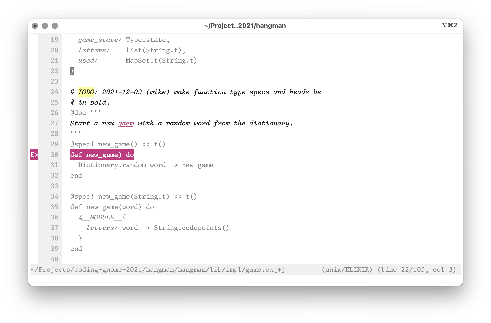

# Thinking

This is a minimal colour scheme for Vim that I’m using to explore my
preferences for editing code.

It's called `thinking` because it seems less distracting for me, and
allows me to _think_ while I’m writing code.

## Rationale

It probably won’t appeal to everyone because my sense of what looks good
seems to go against the current trends in development.

- Documentation and comments are more important than the code for
  someone fresh to the code base.
- Type specifications are more important than the functions.
- Function heads are more important than function bodies.
- Syntax highlighting is a distraction. _Particularly_ gaudy colours
  which seem in vogue these days.
- I like high contrast.

So contrary to common practice in colour schemes the comments are brought
to the fore, and the code is made less prominent.

## Opinions

The colour scheme is only part of the story. I like to be able to
code _without_ endless things popping up, colours changing, while
I’m sketching things out. I like a pleasing font, and that’s subjective.

- I use light mode, so the dark mode might not work too well.
- I use [Elixir][] as my primary programming language, and have had to
  update some of the syntax highlighting to make it look how I like it.
- I like the language server equivalent of Clippy™ to stay out of the way
  until I ask for help.
- I use [Matthew Butterick][]’s [Triplicate][] font. It costs money,
	makes me happy, and looks best on a retina-quality display.
- I prefer serifs if the display can handle them properly, and I _dislike_
  “programming ligatures”.

[Elixir]: https://www.elixir-lang.org
[Matthew Butterick]: https://mbtype.com/bio.html
[Triplicate]: https://mbtype.com/fonts/triplicate/

## Lineage

This started as a fork of [paramount][], and that in turn was based on the
[pencil][] and [off][] colour schemes.

[paramount]: https://github.com/owickstrom/vim-colors-paramount
[pencil]: https://github.com/reedes/vim-colors-pencil
[off]: https://github.com/reedes/vim-colors-off

## License

I've used the copied the [MIT license](LICENSE) from [paramount][]
